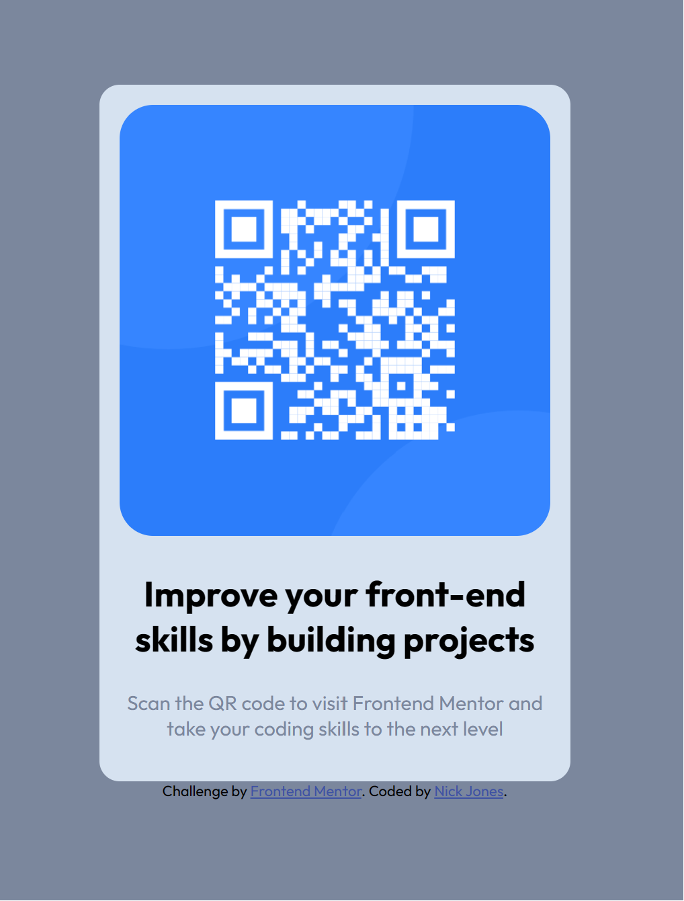

# Frontend Mentor - QR code component solution

This is a solution to the [QR code component challenge on Frontend Mentor](https://www.frontendmentor.io/challenges/qr-code-component-iux_sIO_H). Frontend Mentor challenges help you improve your coding skills by building realistic projects. 

## Table of contents

- [Overview](#overview)
  - [Screenshot](#screenshot)
  - [Links](#links)
- [My process](#my-process)
  - [Built with](#built-with)
  - [What I learned](#what-i-learned)
- [Author](#author)


## Overview

### Screenshot



### Links

- Solution URL: [Add solution URL here](https://your-solution-url.com)
- Live Site URL: [Add live site URL here](https://your-live-site-url.com)

## My process

### Built with

- Semantic HTML5 markup
- CSS custom properties
- Flexbox
- Mobile-first workflow


### What I learned

This was a great review of using flexbox to create and render content in the center of a page. Great for small components.

To see how you can add code snippets, see below:

```html
<h1>Some HTML code I'm proud of</h1>
```
```css
.proud-of-this-css {
  color: papayawhip;
}
```


### Useful resources

- [Flexbox Zombies](https://mastery.games/flexboxzombies/) - This really helped me understand how to use flexbox and the different syntax.
- [Scrimba](https://scrimba.com/) - This is an amazing program. I have learned the majority of what I now know thanks to Scrimba.


## Author

- Website - [Add your name here](https://www.your-site.com)
- Frontend Mentor - [@TheMightyLoafer](https://www.frontendmentor.io/profile/TheMightyLoafer)
- LinkedIn -[nicolas-jones-0930b6177](https://www.linkedin.com/in/nicolas-jones-0930b6177/)